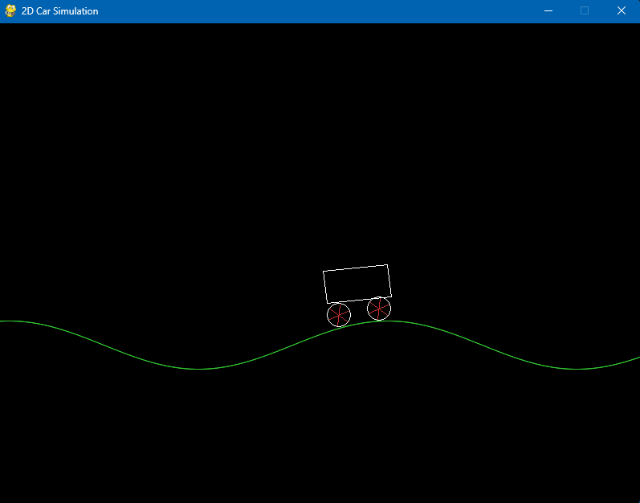
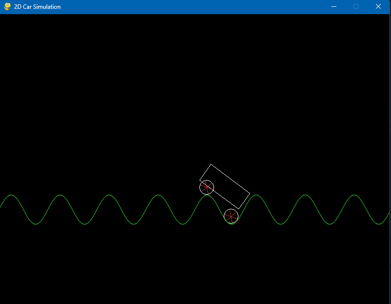

# 2D Car on a Sinewave (Pygame)

A tiny 2D demo of a car driving over a scrolling sine-wave ground.  
Use it to play with wheel spin, terrain scrolling, and a simple suspension effect.

## Controls
- **Left / Right**: accelerate / decelerate (scroll the terrain)
- **Space**: brake
- **Up / Down**: change sine wavelength (v4)

---

## What’s new in v4 (main.py)
- 🔧 **Adjustable wavelength** with Up/Down (live tweak of the sine `k`).
- 🛞 **Wheels stick to the ground** while the wave scrolls (kept from v3).
- 🚗 **Car body tilted to the slope** between wheels (body is drawn as a rotated quad).
- ✳️ **Three spokes per wheel** for clearer spin feedback.
- 🟢 **Anti-aliased ground polyline** for a smoother curve.

---

## Changelog

### v4 (main.py)
- Adds wavelength control (Up/Down).
- Keeps wheels constrained to terrain height.
- Computes a rotated rectangle for the car based on wheel centers.
- Uses three spokes per wheel.

### v3
- Wheels sample the ground height and **ride on the wave** (simple “suspension” look).
- Terrain scrolls with phase; car body not yet rotated.

### v2
- Introduces **sinewave ground** and **scrolling** (phase).
- Wheels spin with velocity; car rides over a moving curve but wheels don’t stick yet.

### v1
- Flat ground line.
- Basic left/right motion with damping + brake.
- Wheels with spokes to visualize rotation.

---

## Screenshots

